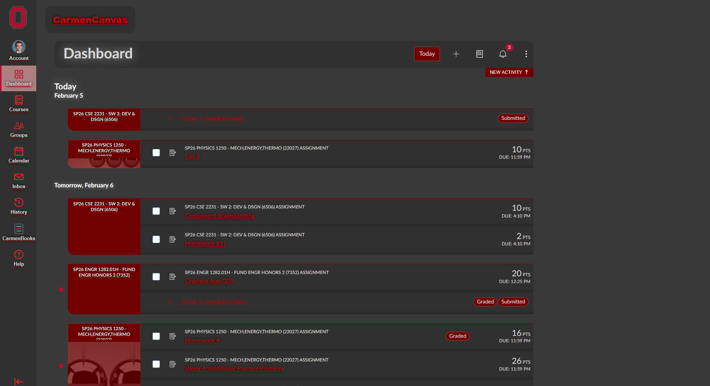
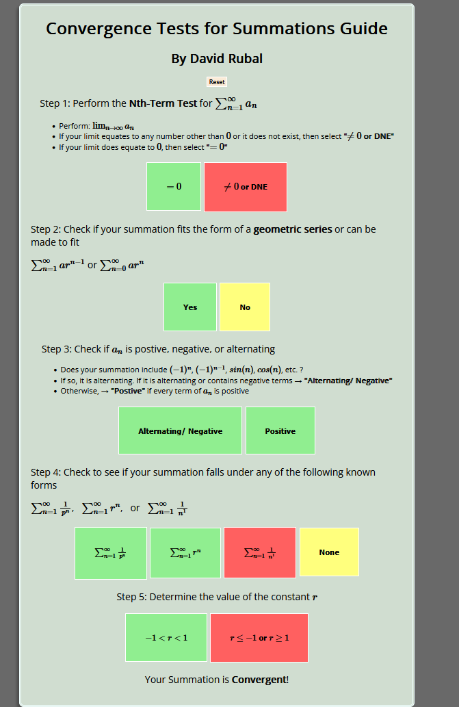

# Portfolio Part 1: Component Brainstorming

- **Name**: David Rubal
- **Dot Number**: rubal.9
- **Due Date**: 2/6/26 @ 4:10 PM EST

## Assignment Overview


The overall goal of the portfolio project is to have you design and implement
your own OSU component. There are no limits to what you choose to design and
implement, but your component must fit within the constraints of our software
sequence discipline. In other words, the component must extend from Standard and
must include both a kernel and a secondary interface.

Because this is a daunting project, we will be providing you with a series of
activities to aid in your design decisions. For example, the point of this
assignment is to help you brainstorm a few possible components and get some
feedback. For each of these components, you will need to specify the high-level
design in terms of the software sequence discipline. In other words, you will
describe a component, select a few kernel methods for your component, and select
a few secondary methods to layer on top of your kernel methods.

You are not required to specify contracts at this time. However, you are welcome
to be as detailed as you'd like. More detail means you will be able to get more
detailed feedback, which may help you decide which component to ultimately
implement.

## Assignment Checklist


To be sure you have completed everything on this assignment, we have littered
this document with TODO comments. You can browse all of them in VSCode by
opening the TODOs window from the sidebar. The icon looks like a tree and will
likely have a large number next to it indicating the number of TODOS. You'll
chip away at that number over the course of the semester. However, if you'd
like to remove this number, you can disable it by removing the following
line from the `settings.json` file:

```json
"todo-tree.general.showActivityBarBadge": true,
```

Which is not to be confused with the following setting that adds the counts
to the tree diagram (you may remove this one as well):

```json
"todo-tree.tree.showCountsInTree": true,
```

## Assignment Learning Objectives


Without learning objectives, there really is no clear reason why a particular
assessment or activity exists. Therefore, to be completely transparent, here is
what we're hoping you will learn through this particular aspect of the portfolio
project. Specifically, students should be able to:

1. Integrate their areas of interest in their personal lives and/or careers with
   their knowledge of software design
2. Determine the achievablility of a software design given time constraints
3. Design high-level software components following the software sequence
   discipline

## Assignment Rubric: 10 Points


Again, to be completely transparent, most of the portfolio project, except the
final submission, is designed as a formative assessment. Formative assessments
are meant to provide ongoing feedback in the learning process. Therefore,
the rubric is designed to assess the learning objectives *directly* in a way
that is low stakes—meaning you shouldn't have to worry about the grade. Just
do good work.

| Learning Objective                                                                                        | Subcategory                 | Weight | Missing                                                     | Beginning                                                                              | Developing                                                                                     | Meeting                                                                                 |
| --------------------------------------------------------------------------------------------------------- | --------------------------- | ------ | ----------------------------------------------------------- | -------------------------------------------------------------------------------------- | ---------------------------------------------------------------------------------------------- | --------------------------------------------------------------------------------------- |
| Students should be able to identify their values, interests, and/or goals as they relate to their designs | Metacognitive Memory        | 3      | (0) No attempt to summarize values, interests, and/or goals | (1) A brief description of values, interests, and/or goals is provided but lacks depth | (2) A description of values, interests, and/or goals is provided by are not related to designs | (3) A description of values, interests, and/or goals is provided and relates to designs |
| Students should be able to predict the feasibility of their designs                                       | Metacognitive Understanding | 3      | (0) No attempt to design components that are feasible       | (1) At least one component is feasible                                                 | (2) At least two components are feasible                                                       | (3) All three components are feasible                                                   |
| Students should be able to use the OSU discipline in all three designs                                    | Metacognitive Application   | 4      | (0) No attempt to follow the OSU discipline in designs      | (1) At least one design follows the OSU discipline                                     | (3) At least two designs follow the OSU discipline                                             | (4) All three designs follow the OSU discipline                                         |

Below is further rationale/explanation for the rubric items above:

1. Each design must align with your personal values and long-term
   goals. Because the goal of this project is to help your build out a
   portfolio, you really ought to care about what you're designing. We'll give
   you a chance to share your personal values, interests, and long-term goals
   below.
2. Each design must be achievable over the course of a single
   semester. Don't be afraid to design something very small. There is no shame
   in keeping it simple.
3. Each design must fit within the software sequence discipline. In
   other words, your design should expect to inherit from Standard, and it
   should contain both kernel and secondary methods. Also, null and aliasing
   must be avoided, when possible. The methods themselves must also be in
   justifiable locations, such as kernel or secondary.

## Pre-Assignment

> Before you jump in, we want you to take a moment to share your interests
> below. Use this space to talk about your career goals as well as your personal
> hobbies. These will help you clarify your values before you start
> brainstorming. Plus it helps us get to know you better! Feel free to share
> images in this section.

A few of my personal hobbies include playing table tennis, learning piano, reading (largely fiction), running, and playing various games (roguelikes, rpgs, smash). Reading is one of those hobbies that has more recently regained my attention, especially when I am not forced to read with a deadline. Running is my main personal commitement that I picked up a few summers ago and its something that I've been able to maintain here thanks to the gyms. Table tennis is a fun one, I wouldn't say that I could play competitively but I enjoy playing with friends when I can. Piano is the hobby that I have not had the time or opportunity to practice while on campus, but I value the prospect of mastery and of understanding the meaning of the notes on a sheet. For the games that I play, I love to hate smash ultimate and I enjoy a run of Balatro or Slay the Spire whenever I can sneak it in.

My career path falls broadly into the computer science field and engineering in general, since I have not had much experience or preference towards a certain specialty. I find that I like making/coding stuff, but I often realize I lack the depth of knowledge required to make super complicated things. For example, customizibility is something that I appreciate, so my limited knowledge of CSS, JavaScript, and the Tampermonkey extension allowed me to create my very own *very janky*  WIP dark mode for CarmenCanvas last semester. Additionally, for a high school math project that permitted any medium for creation, I resorted to making an HTML page out of my own curiosity and to challenge myself.




## Assignment


As previously stated, you are tasked with brainstorming 3 possible components.
To aid you in this process, we have provided [some example components][example-components]
that may help you in your brainstorming. All of these components were made at
some point by one of your peers, so you should feel confident that you can
accomplish any of them.


There is no requirement that you use any of the components listed above.
If you want to model something else, go for it! Very common early object
projects usually attempt to model real-world systems like banks, cars,
etc. Make of this whatever seems interesting to you, and keep in mind that
you're just brainstorming right now. You do not have to commit to anything.

**Note**: Sometimes students will already know what they want to design
and will feel forced to make one-off designs for components they'll never
build. If that's you, you may submit three different designs for the same
component (rather than three different components). This will strengthen your
final design because you'll have an opportunity to think about different ways of
organizing the API. As an example, later in the course, you will see a tree
component that doesn't work by accessing the children through aliases but rather
by assembling and disassembling the tree. You will also see a variety of
list-like components that have different ways of manipulating the data. Think
about different ways you might allow a client to manipulate your component.

### Example Component


To help you brainstorm a few components, we've provided an example below of a
component you already know well: NaturalNumber. We highly recommend that you
mirror the formatting as close as possible in your designs. By following this
format, we can be more confident that your designs will be possible.

- Example Component: `NaturalNumber`
  - **Description**:
    - The purpose of this component is to model a non-negative
      integer. Our intent with this design was to keep a simple kernel that
      provides the minimum functionality needed to represent a natural number.
      Then, we provide more complex mathematical operations in the secondary
      interface.
  - **Kernel Methods**:
    - `void multiplyBy10(int k)`: multiplies `this` by 10 and adds `k`
    - `int divideBy10()`: divides `this` by 10 and reports the remainder
    - `boolean isZero()`: reports whether `this` is zero
  - **Secondary Methods**:
    - `void add(NaturalNumber n)`: adds `n` to `this`
    - `void subtract(NaturalNumber n)`: subtracts `n` from `this`
    - `void multiply(NaturalNumber n)`: multiplies `this` by `n`
    - `NaturalNumber divide(NaturalNumber n)`: divides `this` by `n`, returning
      the remainder
    - ...
  - **Additional Considerations** (*note*: "I don't know" is an acceptable
    answer for each of the following questions):
    - Would this component be mutable? Answer and explain:
      - Yes, basically all OSU components have to be mutable as long as they
        inherit from Standard. `clear`, `newInstance`, and `transferFrom` all
        mutate `this`.
    - Would this component rely on any internal classes (e.g., `Map.Pair`)?
      Answer and explain:
      - No. All methods work with integers or other NaturalNumbers.
    - Would this component need any enums or constants (e.g.,
      `Program.Instruction`)? Answer and explain:
      - Yes. NaturalNumber is base 10, and we track that in a constant called
          `RADIX`.
    - Can you implement your secondary methods using your kernel methods?
      Answer, explain, and give at least one example:
      - Yes. The kernel methods `multiplyBy10` and `divideBy10` can be used to
        manipulate our natural number as needed. For example, to implement
        `increment`, we can trim the last digit off with `divideBy10`, add 1 to
        it, verify that the digit hasn't overflown, and multiply the digit back.
        If the digit overflows, we reset it to zero and recursively call
        `increment`.

Keep in mind that the general idea when putting together these layered designs
is to put the minimal implementation in the kernel. In this case, the kernel is
only responsible for manipulating a digit at a time in the number. The secondary
methods use these manipulations to perform more complex operations like
adding two numbers together.

Also, keep in mind that we don't know the underlying implementation. It would be
completely reasonable to create a `NaturalNumber1L` class which layers the
kernel on top of the existing `BigInteger` class in Java. It would also be
reasonable to implement `NaturalNumber2` on top of `String` as seen in
Project 2. Do not worry about your implementations at this time.

On top of everything above, there is no expectation that you have a perfect
design. Part of the goal of this project is to have you actually use your
component once it's implemented to do something interesting. At which point, you
will likely refine your design to make your implementation easier to use.

### Component Designs

> Please use this section to share your designs.

- Component Design #1: Piano
  - **Description**:
    - This component models the layout and functionality of a piano. The piano will be made up of keys and pedals that can be activated and deactivated by the client.
  - **Kernel Methods**:
    - `void toggleState(Key k)`: alters the state (pressed, unpressed) of the given Key.
      `void toggleState(Pedal p)`: alters the state of the given Pedal.
      `boolean isActive(Key k)`: returns whether the given key is active.
      `boolean isActive(Pedal k)`: returns whether the given pedal is active.
  - **Secondary Methods**:
    - `void playKey(Key... k)`: activates the provided keys if they are inactive
      `void releaseKey(Key... k)`: deactivates the provided keys if they are active
      `Key[] getActiveKeys()`: returns an array of every active key
  - **Additional Considerations** (*note*: "I don't know" is an acceptable
    answer for each of the following questions):
    - Would this component be mutable? Answer and explain:
      - Yes, the keys, pedals, and potentially other attributes of the piano component would be able to be updates as desired after the object is created.
    - Would this component rely on any internal classes (e.g., `Map.Pair`)?
      Answer and explain:
      - Yes, this component would likely rely on the internal classes of Key and Pedal to model the individual components that make up the piano. I would imagine that these components have their own attributes such as frequency/pitch to differentiate them.
    - Would this component need any enums or constants (e.g.,
      `Program.Instruction`)? Answer and explain:
      - I do not know.
    - Can you implement your secondary methods using your kernel methods?
      Answer, explain, and give at least one example:
      - Yes, playKey and releaseKey can be implemented by using isActive to determine the state of each key, followed by toggleState to change the state accordingly.

- Component Design #2: Treadmill
  - **Description**:
    - This component models the functionality of a treadmill, keeping track of each statistic as the treadmill runs.
  - **Kernel Methods**:
    - `void setSpeed(float f)`: sets the speed of the treadmill's tread to the given speed
    `void setIncline(float f)`: sets the magnitude of the treadmill's incline to the given value
    `void setTime(int i)`: sets the current time spent on the treadmill to the given value
  - **Secondary Methods**:
    - `void reset()`: sets every statistic back to its default value. Sets all numbers to 0.
    `void incrementSpeed()`: increments the current speed by 0.1.
    `void decrementSpeed()`: decrements the current speed by 0.1.
    `void incrementIncline()`: increments the current incline by 0.1
    `void decrementIncline()`: decrements the current incline by 0.1
  - **Additional Considerations** (*note*: "I don't know" is an acceptable
    answer for each of the following questions):
    - Would this component be mutable? Answer and explain:
      - Yes, the attributes of this component such as speed, incline, time, etc. would be able to be changed.
    - Would this component rely on any internal classes (e.g., `Map.Pair`)?
      Answer and explain:
      - Maybe, the timer functionality may be offloaded to another class.
    - Would this component need any enums or constants (e.g.,
      `Program.Instruction`)? Answer and explain:
      - I do not know. It may need a constant to convert between distance units if that is a functionality to be added.
    - Can you implement your secondary methods using your kernel methods?
      Answer, explain, and give at least one example:
      - yes, incrementSpeed takes the current speed and calls setSpeed with an argument of current speed + 0.1.

- Component Design #3: Book
  - **Description**:
    - This component models a book/literary work. Every book has a front and back cover and no pages by default. Pages may be added to the book, words may be added to these pages, and chapters may be added to divide up these words.
  - **Kernel Methods**:
    - `void addPage(int i)`: Inserts a page at the page index i of the book.
      `void removePage(int i)`: Removes a page at the page index i of the book.
      `void chapter(int i)`: Begins a new chapter at the start of the given page i if there is no existing chapter on that page. If there is an exisiting chapter on that page, then remove that chapter.
      `void addWord(int i, int pos)`: Adds a word at the given word index pos on the given page i.
      `String removeWord(int i, int pos)`: Removes and returns the word on page i at word index pos.
      `int pageLength(int i)`: reports the number of words on page i.
  - **Secondary Methods**:
    - `void addLine(int i, int pos, String s)`: Adds a line of words s to the given page i at word index pos.
      `String removeLine(int i, int posStart, int posEnd)`: Removes and returns the line of words on page i from word index posStart to word index posEnd.
      `int wordCount()`: reports the number of words within the whole Book.

  - **Additional Considerations** (*note*: "I don't know" is an acceptable
    answer for each of the following questions):
    - Would this component be mutable? Answer and explain:
      - Yes. Pages, chapters, and words can be added and removed from the Book as the client pleases.
    - Would this component rely on any internal classes (e.g., `Map.Pair`)?
      Answer and explain:
      - It is unlikely, unless the pages are to be represented as files or some other object.
    - Would this component need any enums or constants (e.g.,
      `Program.Instruction`)? Answer and explain:
      - I do not know.
    - Can you implement your secondary methods using your kernel methods?
      Answer, explain, and give at least one example:
      - Yes, addLine calls addWord for every word in the given String s, and likely also calls page length to know where to place each word.

## Post-Assignment

The following sections detail everything that you should do once you've
completed the assignment.

### Changelog


At the end of every assignment, you should update the
[CHANGELOG.md](../../CHANGELOG.md) file found in the root of the project folder.
Since this is likely the first time you've done this, we would recommend
browsing the existing file. It includes all of the changes made to the portfolio
project template. When you're ready, you should delete this file and start your
own. Here's what I would expect to see at the minimum:

```markdown
# Changelog

All notable changes to this project will be documented in this file.

The format is based on [Keep a Changelog](https://keepachangelog.com/en/1.1.0/),
and this project adheres to [Calendar Versioning](https://calver.org/) of
the following form: YYYY.0M.0D.

## 2026.02.05

### Added

- Designed a Piano component
- Designed a Treadmill component
- Designed a Book component
```

Here `YYYY.MM.DD` would be the date of your submission, such as 2024.04.21.

You may notice that things are nicely linked in the root CHANGELOG. If you'd
like to accomplish that, you will need to make GitHub releases after each pull
request merge (or at least tag your commits). This is not required.

In the future, the CHANGELOG will be used to document changes in your
designs, so we can gauge your progress. Please keep it updated at each stage
of development.

### Submission


If you have completed the assignment using this template, we recommend that
you convert it to a PDF before submission. If you're not sure how, check out
this [Markdown to PDF guide][markdown-to-pdf-guide]. However, PDFs should be
created for you automatically every time you save, so just double check that
all your work is there before submitting. For future assignments, you will
just be submitting a link to a pull request. This will be the only time
you have to submit any PDFs.


### Peer Review

<!-- TODO: review the peer review guidelines then delete this comment -->

Following the completion of this assignment, you will be assigned three
students' component brainstorming assignments for review. Your job during the
peer review process is to help your peers flesh out their designs. Specifically,
you should be helping them determine which of their designs would be most
practical to complete this semester. When reviewing your peers' assignments,
please treat them with respect. Note also that we can see your comments, which
could help your case if you're looking to become a grader. Ultimately, we
recommend using the following feedback rubric to ensure that your feedback is
both helpful and respectful (you may want to render the markdown as HTML or a
PDF to read this rubric as a table).

| Criteria of Constructive Feedback | Missing                                                                                                                           | Developing                                                                                                                                                                                                                                | Meeting                                                                                                                                                               |
| --------------------------------- | --------------------------------------------------------------------------------------------------------------------------------- | ----------------------------------------------------------------------------------------------------------------------------------------------------------------------------------------------------------------------------------------- | --------------------------------------------------------------------------------------------------------------------------------------------------------------------- |
| Specific                          | All feedback is general (not specific)                                                                                            | Some (but not all) feedback is specific and some examples may be provided.                                                                                                                                                                | All feedback is specific, with examples provided where possible                                                                                                       |
| Actionable                        | None of the feedback provides actionable items or suggestions for improvement                                                     | Some feedback provides suggestions for improvement, while some do not                                                                                                                                                                     | All (or nearly all) feedback is actionable; most criticisms are followed by suggestions for improvement                                                               |
| Prioritized                       | Feedback provides only major or minor concerns, but not both. Major and minar concerns are not labeled or feedback is unorganized | Feedback provides both major and minor concerns, but it is not clear which is which and/or the feedback is not as well organized as it could be                                                                                           | Feedback clearly labels major and minor concerns. Feedback is organized in a way that allows the reader to easily understand which points to prioritize in a revision |
| Balanced                          | Feedback describes either strengths or areas of improvement, but not both                                                         | Feedback describes both strengths and areas for improvement, but it is more heavily weighted towards one or the other, and/or descusses both but does not clearly identify which part of the feedback is a strength/area for improvement  | Feedback provides balanced discussion of the document's strengths and areas for improvement. It is clear which piece of feedback is which                             |
| Tactful                           | Overall tone and language are not appropriate (e.g., not considerate, could be interpreted as personal criticism or attack)       | Overall feedback tone and language are general positive, tactul, and non-threatening, but one or more feedback comments could be interpretted as not tactful and/or feedback leans toward personal criticism, not focused on the document | Feedback tone and language are positive, tactful, and non-threatening. Feedback addesses the document, not the writer                                                 |

### Assignment Feedback

If you'd like to give feedback for this assignment (or any assignment, really),
make use of [this survey][survey]. Your feedback helps make assignments
better for future students.

<!-- TODO: follow the link to share your feedback then delete this comment -->

[example-components]: https://therenegadecoder.com/code/the-never-ending-list-of-small-programming-project-ideas/
[markdown-to-pdf-guide]: https://therenegadecoder.com/blog/how-to-convert-markdown-to-a-pdf-3-quick-solutions/
[survey]: https://forms.gle/dumXHo6A4Enucdkq9
